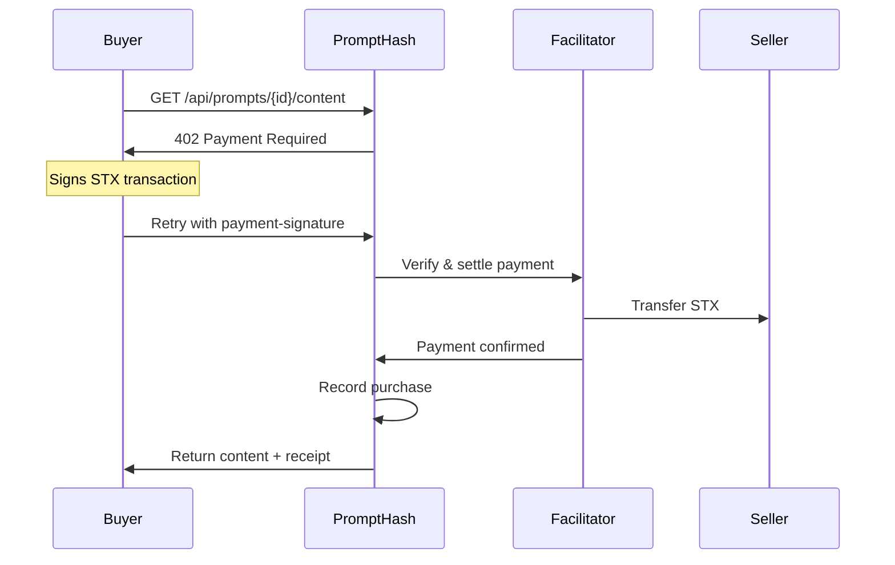

# PromptHash API Testing Guide

Complete guide for testing the PromptHash x402 payment-enabled API marketplace.

## Quick Start

### Step 1: Browse Available Prompts

Get a list of all prompts without requiring payment or authentication:

```bash
curl https://prompt-hash-x402.vercel.app/api/prompts
```

**Response:**
```json
{
  "prompts": [
    {
      "id": "7de680e1-6cea-4967-903b-7b28c3387885",
      "title": "Google Prompt",
      "description": "Google prompt",
      "category": "Creative Writing",
      "price_base_units": "100000",
      "currency": "STX",
      "seller_wallet": "ST16K4ZYM14WPG9GZQ5BPXNQAEVTJPRMA4VWJCXYY",
      "is_listed": true
    }
  ]
}
```

### Step 2: Get Prompt Payment Details

Using an ID from step 1 (example: `7de680e1-6cea-4967-903b-7b28c3387885`):

```bash
curl https://prompt-hash-x402.vercel.app/api/prompts/7de680e1-6cea-4967-903b-7b28c3387885/content
```

**Response:** HTTP 402 Payment Required
```json
{
  "x402Version": 2,
  "resource": {
    "url": "https://prompt-hash-x402.vercel.app/api/prompts/7de680e1-6cea-4967-903b-7b28c3387885/content",
    "description": "Unlock premium content for \"Google Prompt\"",
    "mimeType": "application/json"
  },
  "accepts": [
    {
      "scheme": "exact",
      "network": "stacks:2147483648",
      "amount": "100000",
      "asset": "STX",
      "payTo": "ST16K4ZYM14WPG9GZQ5BPXNQAEVTJPRMA4VWJCXYY",
      "maxTimeoutSeconds": 300
    }
  ]
}
```

### Step 3: Purchase with x402 Client

Using the `x402-stacks` library for automatic payment handling:

```typescript
import { wrapAxiosWithPayment, privateKeyToAccount } from 'x402-stacks';
import axios from 'axios';

const account = privateKeyToAccount(process.env.PRIVATE_KEY, 'testnet');
const api = wrapAxiosWithPayment(axios.create({
  baseURL: 'https://prompt-hash-x402.vercel.app'
}), account);

// Automatically handles 402 payment flow
const response = await api.get('/api/prompts/7de680e1-6cea-4967-903b-7b28c3387885/content');
console.log(response.data.content); // Unlocked content
console.log(response.data.payment); // Payment details
```

**Successful Purchase Response:**
```json
{
  "content": "The actual premium prompt content...",
  "payment": {
    "success": true,
    "payer": "ST1PQHQKV0RJXZFY1DGX8MNSNYVE3VGZJSRTPGZGM",
    "transaction": "0xabcdef1234567890...",
    "network": "stacks:2147483648"
  }
}
```

---

## Available Endpoints

### 1. Browse Prompts (No Payment Required)

**Endpoint:** `GET /api/prompts`  
**Authentication:** None  
**Payment:** Not required  
**Description:** Get a list of all publicly listed prompts

**Query Parameters:**
- `seller_wallet` (optional): Filter prompts by seller address
- `include_unlisted` (optional): Include unlisted prompts when filtering by seller

**Example:**
```bash
# Get all prompts
curl https://prompt-hash-x402.vercel.app/api/prompts

# Get prompts from specific seller
curl "https://prompt-hash-x402.vercel.app/api/prompts?seller_wallet=ST16K4ZYM14WPG9GZQ5BPXNQAEVTJPRMA4VWJCXYY"
```

**Response:**
```json
{
  "prompts": [
    {
      "id": "uuid",
      "title": "string",
      "description": "string",
      "category": "string",
      "image_url": "string | null",
      "price_base_units": "string",
      "currency": "STX | SBTC",
      "seller_wallet": "string",
      "is_listed": boolean
    }
  ]
}
```

---

### 2. Purchase Prompt Content (x402 Payment Required)

**Endpoint:** `GET /api/prompts/{id}/content`  
**Authentication:** x402 payment signature  
**Payment:** STX to seller's wallet  
**Description:** Purchase and unlock premium prompt content

**Path Parameters:**
- `id` (required): Prompt UUID from browse endpoint

**Headers:**
- `x-buyer-wallet` (optional): Your Stacks wallet address for bypass checks
- `payment-signature` (required for payment): Base64-encoded signed transaction

**Bypass Conditions** (No payment required):
1. **Seller Access**: If `x-buyer-wallet` matches the prompt's `seller_wallet`
2. **Existing Purchase**: If buyer has already purchased this prompt

**Example (with x402 client):**
```typescript
const response = await api.get('/api/prompts/7de680e1-6cea-4967-903b-7b28c3387885/content');
```

**Example (manual curl to see 402):**
```bash
curl https://prompt-hash-x402.vercel.app/api/prompts/7de680e1-6cea-4967-903b-7b28c3387885/content
```

---

### 3. View Your Purchases (No Payment Required)

**Endpoint:** `GET /api/purchases`  
**Authentication:** None  
**Payment:** Not required  
**Description:** View all prompts you've purchased

**Query Parameters:**
- `buyer_wallet` (required): Your Stacks wallet address

**Example:**
```bash
curl "https://prompt-hash-x402.vercel.app/api/purchases?buyer_wallet=ST1PQHQKV0RJXZFY1DGX8MNSNYVE3VGZJSRTPGZGM"
```

**Response:**
```json
{
  "purchases": [
    {
      "id": "uuid",
      "prompt_id": "uuid",
      "buyer_wallet": "string",
      "currency": "STX",
      "amount_base_units": "string",
      "payment_tx": "0x...",
      "purchased_at": "2026-02-12T10:30:00Z",
      "prompt": {
        "id": "uuid",
        "title": "string",
        "description": "string",
        // ... full prompt metadata
      }
    }
  ]
}
```

---

## Current Live Prompts

These prompts are currently available for purchase on testnet:

### 1. Google Prompt
- **ID:** `7de680e1-6cea-4967-903b-7b28c3387885`
- **Title:** Google Prompt
- **Description:** Google prompt
- **Category:** Creative Writing
- **Price:** 0.0001 STX (100,000 microSTX)
- **Seller:** `ST16K4ZYM14WPG9GZQ5BPXNQAEVTJPRMA4VWJCXYY`
- **Status:** Listed

### 2. Welcome
- **ID:** `500d4f6d-0e4e-4bcd-8703-e0def4151c4c`
- **Title:** Welcome
- **Description:** Welcome to my prompt
- **Category:** Creative Writing
- **Price:** 0.0001 STX (100,000 microSTX)
- **Seller:** `STAPYXMB6VYHDDD0MYS99ERW57ZG1FKXV32A3PYT`
- **Status:** Listed

---

## Error Messages

### "Prompt not found"
- **Status Code:** 404
- **Cause:** The prompt ID doesn't exist in the database
- **Solution:** Browse `/api/prompts` to get valid prompt IDs
- **Example:** Using `{id}` literally instead of replacing with actual UUID

### HTTP 402 Payment Required
- **Status Code:** 402
- **Cause:** Payment is required to access this resource
- **Solution:** Use x402 client library to handle payment automatically
- **Response includes:** Payment details (amount, recipient, network)

### "Prompt is not listed for sale"
- **Status Code:** 404
- **Cause:** Prompt exists but seller has unlisted it
- **Solution:** Contact seller or choose a different prompt

### "Invalid payment-signature header"
- **Status Code:** 400
- **Cause:** Payment signature is malformed or invalid
- **Solution:** Ensure x402 client is correctly configured

### "Payment settlement failed"
- **Status Code:** 402
- **Cause:** Payment verification or blockchain settlement failed
- **Solution:** Check wallet balance, transaction details, and facilitator status

---

## Testing with AI Agents

AI agents can discover and purchase prompts automatically via x402scan:

### Discovery Flow

1. **Find Marketplace:**
   - Agent queries x402scan: `https://scan.stacksx402.com`
   - Discovers PromptHash in the directory

2. **Read API Schema:**
   - Agent fetches: `https://prompt-hash-x402.vercel.app/api/x402/schema`
   - Parses `accepts` array for payment endpoints
   - Reads `outputSchema` to understand API structure

3. **Browse Prompts:**
   - Agent calls: `GET /api/prompts`
   - Selects prompt based on criteria (price, category, description)

4. **Purchase Content:**
   - Agent calls: `GET /api/prompts/{id}/content`
   - Receives 402 Payment Required
   - Signs transaction with wallet
   - Retries request with `payment-signature` header
   - Receives unlocked content

### Example AI Agent Code

```typescript
import { wrapAxiosWithPayment, privateKeyToAccount } from 'x402-stacks';
import axios from 'axios';

class PromptPurchasingAgent {
  private api: any;

  constructor(privateKey: string) {
    const account = privateKeyToAccount(privateKey, 'testnet');
    this.api = wrapAxiosWithPayment(
      axios.create({ baseURL: 'https://prompt-hash-x402.vercel.app' }),
      account
    );
  }

  async discoverPrompts(category?: string) {
    const { data } = await axios.get('https://prompt-hash-x402.vercel.app/api/prompts');
    return category 
      ? data.prompts.filter(p => p.category === category)
      : data.prompts;
  }

  async purchasePrompt(promptId: string) {
    try {
      const { data } = await this.api.get(`/api/prompts/${promptId}/content`);
      return {
        success: true,
        content: data.content,
        transaction: data.payment.transaction
      };
    } catch (error) {
      return {
        success: false,
        error: error.message
      };
    }
  }

  async findAndPurchaseBestPrompt(category: string, maxPrice: string) {
    const prompts = await this.discoverPrompts(category);
    const affordable = prompts.filter(p => 
      BigInt(p.price_base_units) <= BigInt(maxPrice)
    );
    
    if (affordable.length === 0) {
      throw new Error('No affordable prompts found');
    }

    // Purchase the cheapest one
    affordable.sort((a, b) => 
      Number(BigInt(a.price_base_units) - BigInt(b.price_base_units))
    );
    
    return this.purchasePrompt(affordable[0].id);
  }
}

// Usage
const agent = new PromptPurchasingAgent(process.env.AGENT_PRIVATE_KEY);
const result = await agent.findAndPurchaseBestPrompt('Creative Writing', '500000');
console.log('Purchased content:', result.content);
```

---

## x402 Protocol Details

### Payment Flow



### Headers

**V2 Protocol (Current):**
- `payment-required`: Base64-encoded payment requirements (server → client)
- `payment-signature`: Base64-encoded signed transaction (client → server)
- `payment-response`: Base64-encoded settlement result (server → client)

### Price Conversion

**STX:**
- 1 STX = 1,000,000 microSTX
- Example: 0.0001 STX = 100,000 microSTX

**sBTC:**
- 1 BTC = 100,000,000 satoshis
- Example: 0.00001 BTC = 1,000 satoshis

---

## Troubleshooting

### Issue: Can't find prompt IDs

**Problem:** You're trying to access `https://prompt-hash-x402.vercel.app/api/prompts/{id}/content` with `{id}` literally.

**Solution:**
1. First browse: `curl https://prompt-hash-x402.vercel.app/api/prompts`
2. Copy an actual `id` from the response
3. Replace `{id}` with the actual UUID
4. Example: `https://prompt-hash-x402.vercel.app/api/prompts/7de680e1-6cea-4967-903b-7b28c3387885/content`

### Issue: Payment fails

**Checklist:**
- [ ] Wallet has sufficient STX balance (price + network fees)
- [ ] Using correct network (testnet vs mainnet)
- [ ] Facilitator is operational: `https://facilitator.stacksx402.com/supported`
- [ ] Prompt is still listed: Check `/api/prompts`

### Issue: Can't re-access purchased content

**Solution:** Include your wallet address in the `x-buyer-wallet` header:
```bash
curl -H "x-buyer-wallet: ST1PQHQKV0RJXZFY1DGX8MNSNYVE3VGZJSRTPGZGM" \
  https://prompt-hash-x402.vercel.app/api/prompts/7de680e1-6cea-4967-903b-7b28c3387885/content
```

---

## Additional Resources

- **x402-stacks Library:** https://www.npmjs.com/package/x402-stacks
- **x402scan Directory:** https://scan.stacksx402.com
- **Stacks Explorer (testnet):** https://explorer.stacks.co/?chain=testnet
- **Stacks Faucet (testnet):** https://explorer.stacks.co/sandbox/faucet?chain=testnet
- **Project Repository:** https://github.com/your-repo/prompt-hash-x402

---

**Last Updated:** February 12, 2026  
**Network:** Stacks Testnet  
**Protocol Version:** x402 V2
