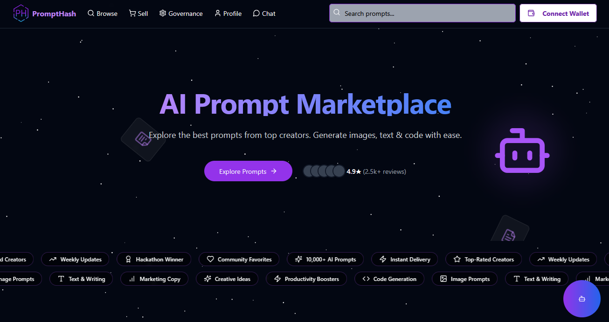

## PromptHash (BNB + ASI AI)



PromptHash is a BNB Chain prompt marketplace powered by ASI AI for chat, prompt improvement, and live model discovery. The frontend runs on Next.js/Tailwind, the marketplace logic lives in a Solidity contract on BNB, and the AI rails are provided by the FastAPI service in `asi-ai` (also hosted at `https://prompthash-asi.onrender.com`).

---

## What's inside

- **Frontend (`src/`)**: Next.js + Tailwind UI for browsing, buying, and selling prompts with wallet auth.
- **BNB smart contract (`contracts/`)**: Solidity contract plus ABI/bin/metadata artifacts for prompt listing and settlement.
- **ASI FastAPI service (`asi-ai/`)**: REST API for chat, prompt improver, and model catalog with an HTML UI at `/`.

---

## Quick start (frontend using hosted services)

1) Install dependencies:

```bash
npm install
```

2) Create `.env.local`:

```ini
NEXT_PUBLIC_API_URL=https://prompthash-asi.onrender.com   # or http://127.0.0.1:8000 if running FastAPI locally
NEXT_PUBLIC_DEPLOYMENT_ADDRESS=0xYourPromptHashContract   # BNB testnet or mainnet address
NEXT_PUBLIC_THIRDWEB_CLIENT_ID=your_thirdweb_client_id
```

3) Run the app:

```bash
npm run dev
```

Open `http://localhost:3000` and connect a BNB-compatible wallet (for buying or listing prompts).

---

## Run the ASI FastAPI service locally (optional)

The FastAPI backend in `asi-ai/prompthash_api` mirrors the hosted service and exposes `/api/chat`, `/api/improve`, `/api/models`, plus a simple UI at `/`.

```bash
cd asi-ai
python -m venv .venv
.venv\Scripts\Activate.ps1   # Windows (use source .venv/bin/activate on macOS/Linux)
pip install -r requirements.txt
set ASICLOUD_API_KEY=your_asi_key
uvicorn prompthash_asi.main:app --reload --host 0.0.0.0 --port 8000
```

- Required env: `ASICLOUD_API_KEY`
- Optional env: `ASICLOUD_BASE_URL`, `PROMPT_AGENT_MODEL`, `PROMPT_IMPROVER_MODEL`, `ASI_AGENT_API`, `ASI_IMPROVER_API`, `ASI_MODELS_API`
- UI and docs: `http://127.0.0.1:8000/` (HTML), `/docs` (Swagger), `/redoc` (ReDoc)
- Key endpoints: `POST /api/chat`, `POST /api/improve`, `GET /api/models`, `GET /api/health`, `GET /api/improver/health`, `GET /api/models/health`

Point `NEXT_PUBLIC_API_URL` at `http://127.0.0.1:8000` if you want the frontend to hit your local instance.

---
## Architecture For ASI API

High-level layout of the `prompthash-api` folder:

- `prompthash-api/` – project root for this service
  - `requirements.txt` – Python dependencies
  - `FASTAPI_USAGE.md` – quick integration and API usage guide
  - `frontend_app.py` – legacy Flask proxy app for the original uAgents-based agents
  - `templates/asi_chat.html` – single-page HTML UI for chat + prompt improver
  - `prompthash_api/` – FastAPI package
    - `main.py` – FastAPI app factory and router wiring
    - `routers/` – endpoint definitions:
      - `chat.py` – chat API routes
      - `improver.py` – prompt improver routes
      - `models.py` – model listing routes
      - `pages.py` – HTML page routes (serves `/` and static UI)
    - `services/` – business logic/services:
      - `chat_service.py` – chat orchestration and history handling
      - `prompt_improver_service.py` – prompt improvement logic
      - `model_list_service.py` – ASI model listing and categorization
    - `schemas/` – Pydantic models for request/response bodies:
      - `chat.py`, `improver.py`, `models.py`
    - `core/`:
      - `config.py` – configuration and environment variable loading
      - `state.py` – in-memory state helpers (counters, history)
    - `clients/asi_client.py` – ASI/uAgents client wrapper used by services

At runtime, the FastAPI app is constructed in `prompthash_asi.main.create_app()` and exposed as a module-level `app` suitable for ASGI servers like `uvicorn` or `gunicorn`.

---

## Deploy or update the PromptHash contract on BNB

- Contract source: `contracts/PromptHash.sol`
  - `create` requires `PROMPT_CREATION_FEE` (0.0002 BNB by default) and auto-lists the prompt.
  - `buy` transfers the listed price to the seller and moves ownership.
  - `updateSaleStatus` (owner-only) toggles `onSale` and sets price (pass price in whole BNB; it is stored in wei).
  - `likePrompt`, `getUserPrompts`, `getAllPrompts`, and `withdraw` (owner fee collection) round out the marketplace flow.
- Artifacts for integration: `PromptHashAbi.json`, `PromptHash.abi`, `PromptHash.bin`, `PromptHash_metadata.json`
- Deployment script: `contracts/deployScript.js` (ethers). Configure env vars, then deploy:

```bash
set RPC_URL=https://bsc-testnet.bnbchain.org    # or a mainnet RPC
set OPERATOR_ACCOUNT_PRIVATE_KEY=0xYourEvmKey   # deployer key
node contracts/deployScript.js
```

After deployment, set `NEXT_PUBLIC_DEPLOYMENT_ADDRESS` in `.env.local` so the frontend points to the right contract.

---

## Project layout

```
prompt-hash-BNB/
├─ src/                  # Next.js frontend (pages, components, lib)
├─ contracts/            # Solidity contract and ABI/bin/metadata + deploy script
└─ asi-ai/               # FastAPI service for chat, prompt improver, models
```

---

## Notes for BNB usage

- Use a BNB-compatible wallet (e.g., MetaMask) on the same network as your deployed contract.
- Prices are stored in wei; the UI expects BNB denominations when listing.
- The default AI backend is the hosted ASI service. Switch to your local FastAPI instance by changing `NEXT_PUBLIC_API_URL`.
